# Bomb Lab

## phase_1

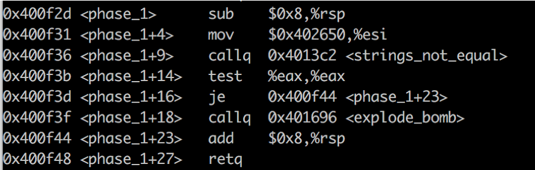

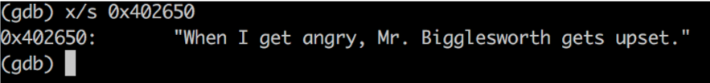

### 정답 : When I get angry, Mr. Bigglesworth gets upset.

## phase_2

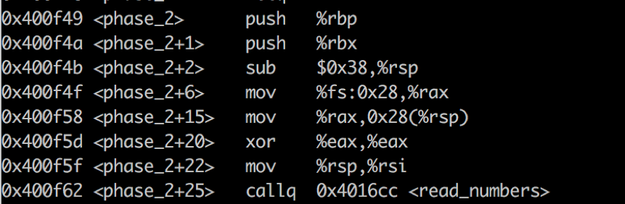

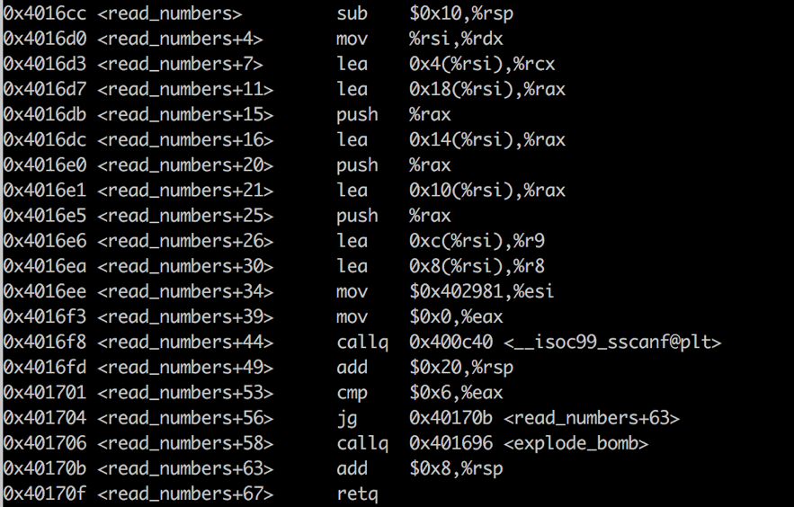

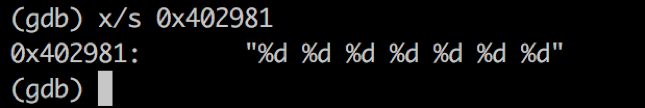

위와 같이 <read_numbers> 함수에서 정답이 총 7개의 숫자인 것을 알 수 있습니다.
따라서 7개의 숫자를 입력하면 첫번째 bomb을 피할 수 있습니다.

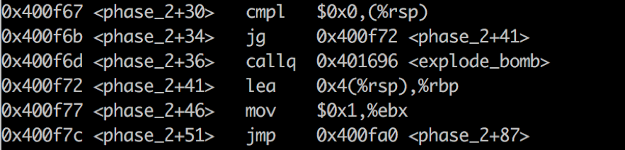

첫번째 입력한 숫자와 0을 비교해서, 0보다 크면 두번째 bomb을 피할 수 있습니다.
두번째 입력한 숫자를 %rbp에 넣고 %rbx에 1을 넣은 후, phase_2+87로 점프합니다.

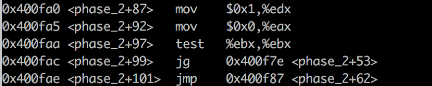

%rdx에 1, %rax에 0을 넣습니다.

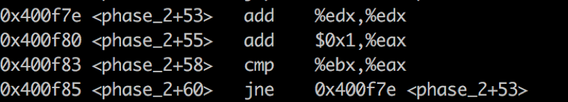

맨 처음 %rdx는 2가 되고 %rdx와 %rax가 같아질 때 까지 %rax에 1씩 더합니다.

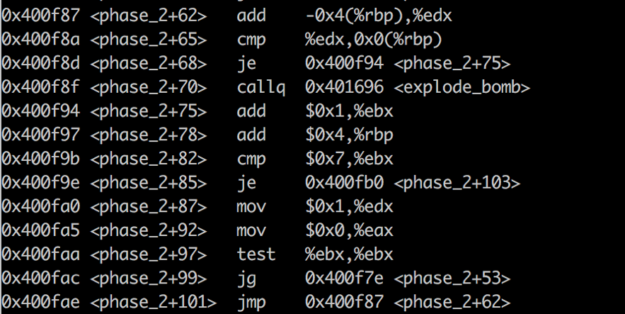

%rdx에 첫번째 입력한 값이 더해집니다.
지금까지의 코드를 해석해보면 첫번째 입력값은 0보다 커야하고, 그 수에 2를 더합니다.
따라서 두번째 수는 (첫번째 입력값 + 2), 세번째 수는 (두번째 수 + 두번째 수) … 가 됩니다.
숫자가 총 7개이므로 7번 반복합니다.

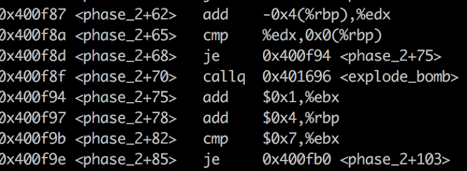

마지막 7번째에는 rbx와 7을 비교한 후 phase_2+103으로 점프합니다.

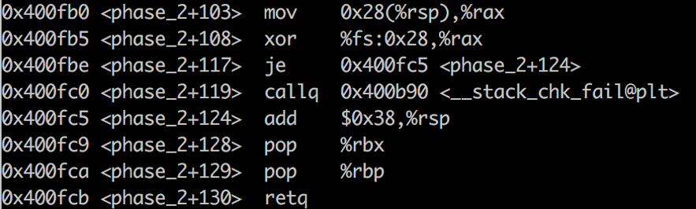

### 정답 : 2 4 8 16 32 64 128

## phase_3

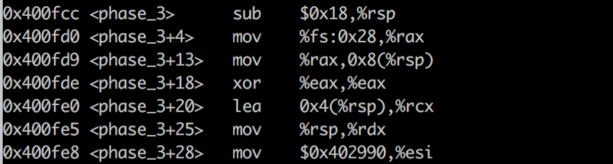

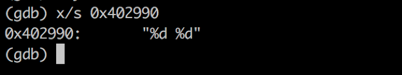

답이 2개의 숫자인 것을 알 수 있습니다.

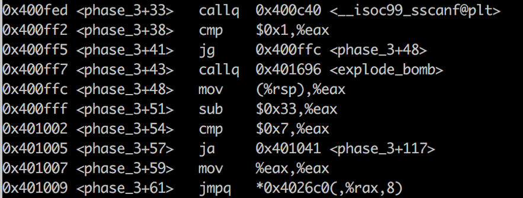

2개의 숫자를 입력하면 첫번째 bomb을 피할 수 있습니다.
처음 입력된 값을 %rax에 넣고, 0x33 즉 십진수 51을 뺍니다.
이 수가 7보다 크면 bomb이 터지기 때문에,
처음 입력 값 a의 범위는 51 <= a <= 58이 됩니다.

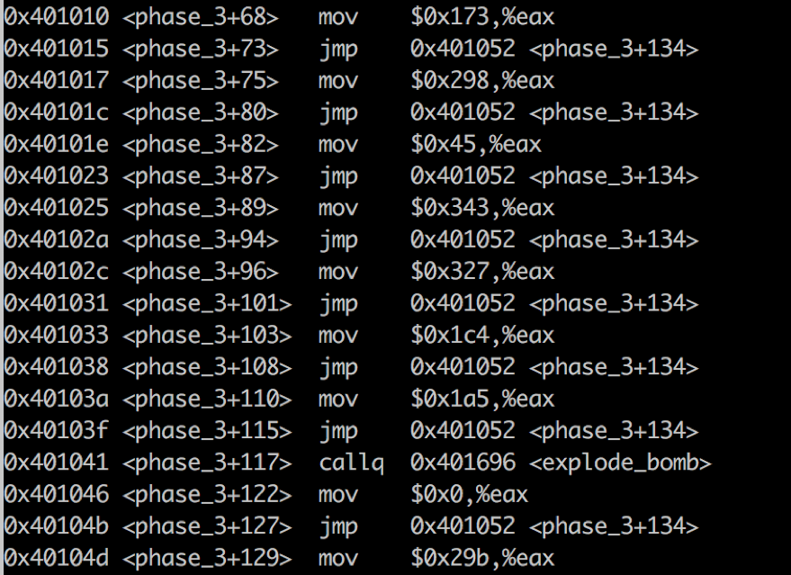

처음 입력값에 따라 두번째 값은 switch문으로 구성되어 있습니다.
처음 입력값 8개에 따라 두번째 값은 10진수로 371, 664, 69, 835, 807, 452, 421, 667, 총 8개중 하나로 정해집니다.
처음 입력값이 51일 때, %rax가 0이므로 두번째 값은 667이 됩니다.

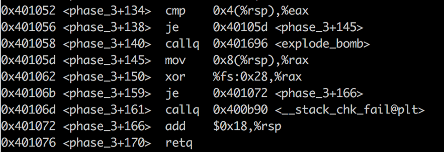

### 정답 : 51 667

## phase_4

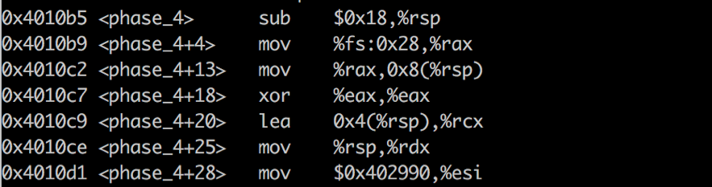

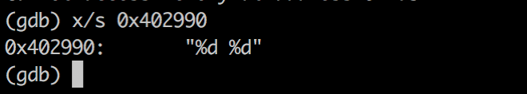

답이 2개의 숫자인 것을 알 수 있습니다.

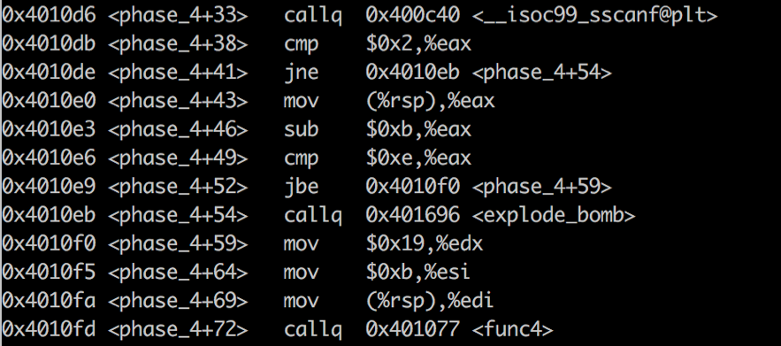

2개의 숫자가 입력되면 첫번째 폭탄을 피할 수 있습니다.
첫번째 입력된 숫자를 %rax에 저장하고, 0xb 즉 십진수 11을 뺍니다.
이 수와 0xe 즉 15와 비교하여 15보다 크면 폭탄이 터지게 되므로,
첫번째 숫자 a의 범위는 11 <= a <= 26 이 됩니다.
그 후 함수 func4가 실행됩니다.

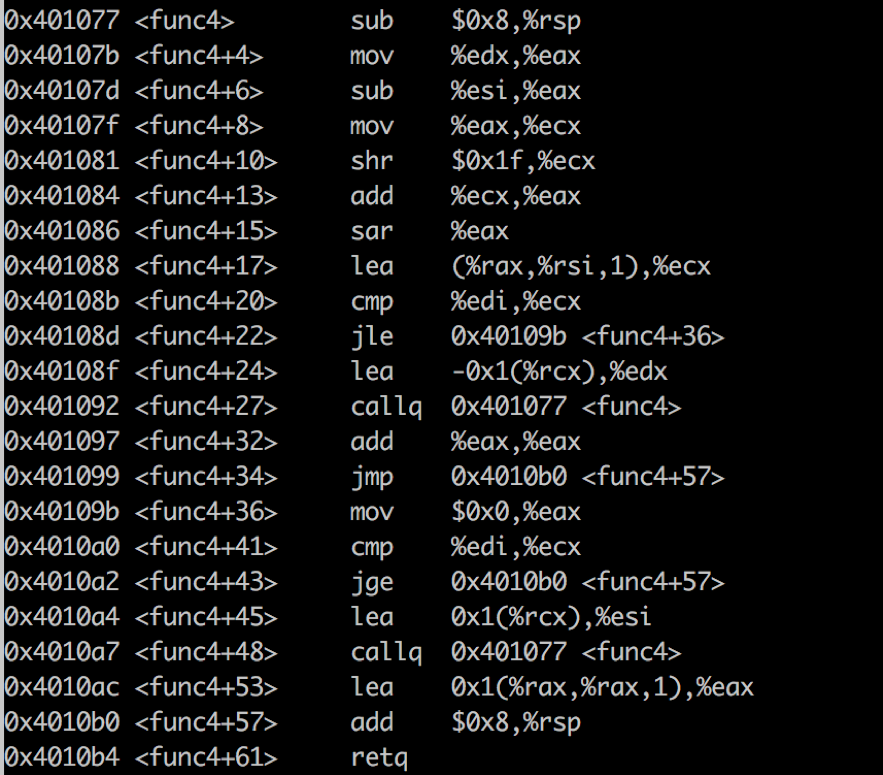

두번째 수는 0이 됩니다.

### 정답 : 11 0

##phase_5

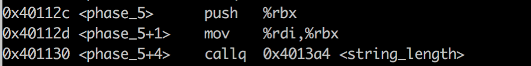

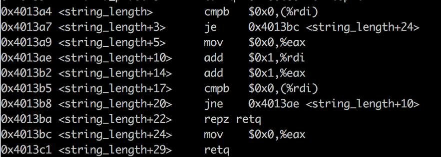

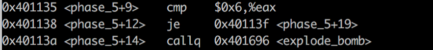

정답이 6개의 문자인 것을 알 수 있습니다.
따라서 6개의 문자를 입력하면 첫번째 폭탄을 피할 수 있습니다.

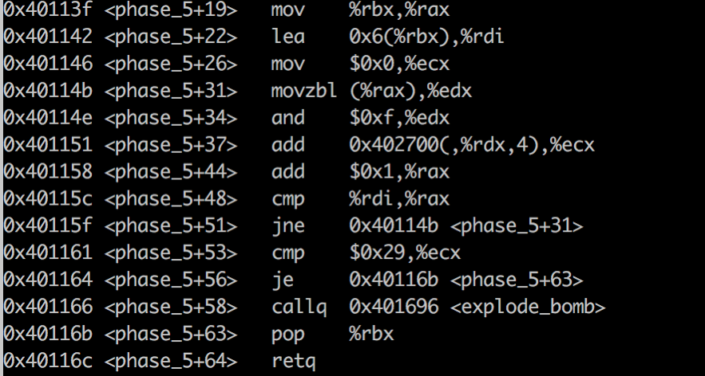

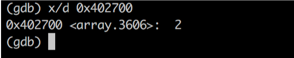

입력된 문자를 0xf와 and 연산해서 나온 숫자를 %rdx에 저장합니다.
따라서 아스키코드에 따라, 영어 소문자를 16진수로 표현한 값을 참고하여 1의 자리수면 가져옵니다.
예를 들어 문자가 a이면 %rdx에 1을 저장합니다.
그 후 주소값 0x402700으로 시작하는 배열에서 %rax 값이 들어있는 인덱스 값을 %rcx에 더합니다. (%rcx의 시작값은 0입니다.) 주소값 0402700 으로 시작하는 배열 값은 <그림 1>과 같습니다. 이 작업을 6번 반복합니다.
예를 들어 문자가 a이면 %rdx은 1입니다. 인덱스 3번에 1이 저장되어 있으므로, %rcx에 3을 더합니다. 
이렇게 해서 나온 %rcx의 값이 0x29 즉 십진수 41이 되면 성공입니다.
따라서 %rcx가 41이 되도록 설정하면,
하나의 정답으로는 cphfdo가 나오게 됩니다.

### 정답 : cphfdo

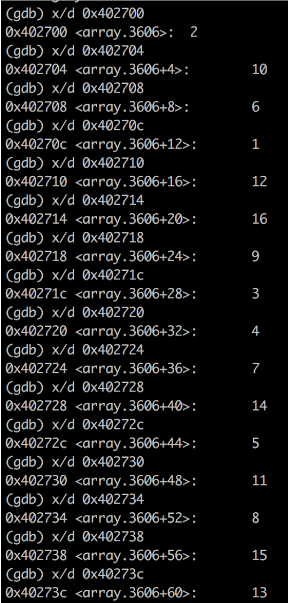

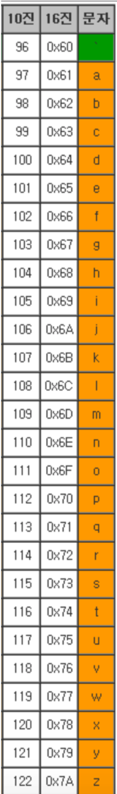

