# Attack Lab

## Code injection attacks: Level 1

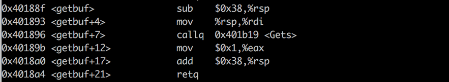

패딩이 0x38, 즉 56개가 필요합니다.

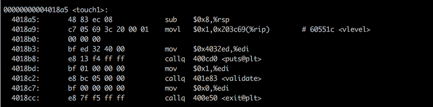

touch1의 주소는 00000000004017a5입니다.

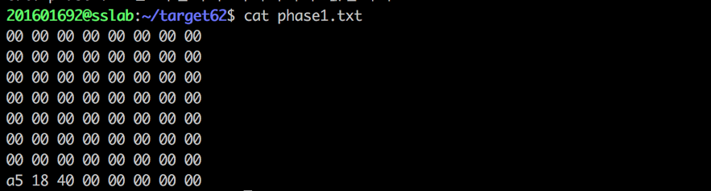

패딩은 총 56개, 리틀엔디안이므로 위와 같이 touch1의 주소를 적어줍니다.
./hex2raw < phase1.txt > raw-phase1.txt
./ctarget < raw-phase1.txt
하면 성공입니다 !

## Code injection attacks: Level 2

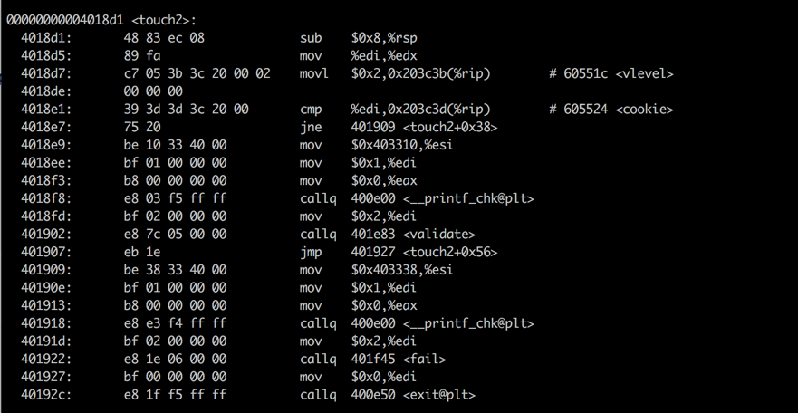

%rdi에 저장되는 값을 알아야합니다.
따라서 phase2.s 를 작성합니다. 

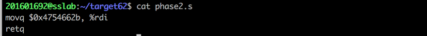

gcc -c phase2.s
objdump -d phase2.o > phase2.d
하게 되면 phase2.d 내용은 다음과 같습니다.

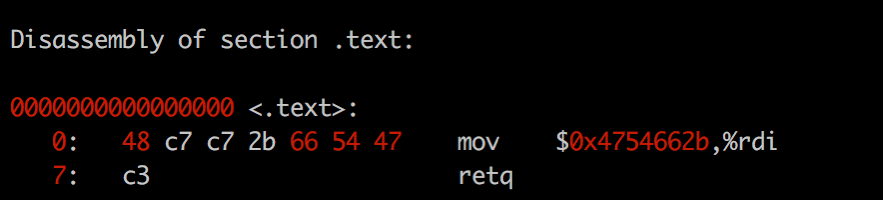

다음 명령어를 쭉 치게 되면
gdb ctarget
b getbuf
r
disas
u 0x40189b

callq 0x401b19 <Gets> 까지 수행된 레지스터 값을 볼 수 있습니다.
이 시점에서 
x/s $rsp
하게 되면

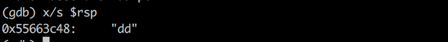

rsp 레지스터의 주소값 0x55553c48 을 알 수 있습니다.

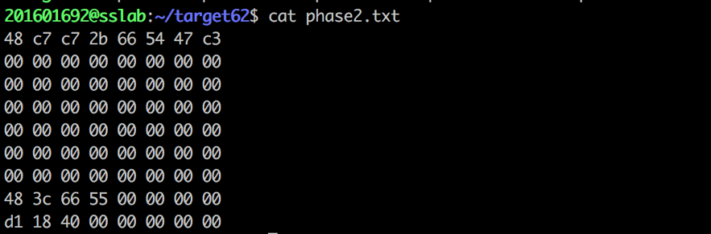

첫째줄엔 %rsp에 저장된 값,
그 후 56개의 패딩,
%rsp 레지스터의 주소,
touch2의 주소를 순서대로 적어주면 됩니다.

./hex2raw < phase2.txt > raw-phase2.txt
./ctarget < raw-phase2.txt
하면 성공입니다 ! 

## Code injection attacks: Level 3

패딩 0x38 + %rsp 레지스터의 주소 8 + touch3의 주소 8 
= 56 + 8 + 8 = 72

%rsp 레지스터의 주소는 0x55663c48
0x55663c48 + 72 = 0x55663c48 + 0x48 = 0x55663c90
따라서 phase3.s를 다음과 같이 작성합니다.

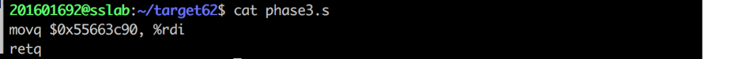

gcc -c phase3.s
objdump -d phase3.o > phase3.d
하게 되면 

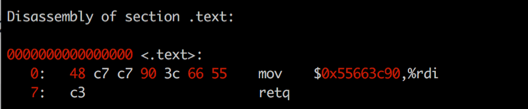

쿠키값은 다음과 같습니다.

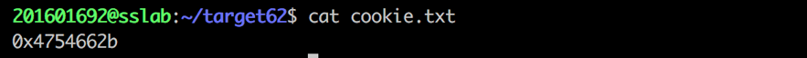

따라서 위에서 구한 0x55663c90에 저장된 값,
패딩, %rsp 레지스터 값, touch3의 주소, 쿠키값을 차례로 적으면 성공입니다 !
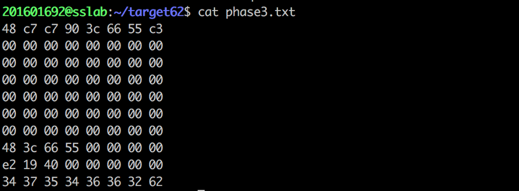

## ROP: Level 2

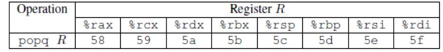

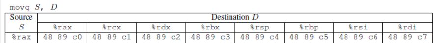

위 자료에서 보면 다음과 같은 값 가집니다.
popq %rax => 58
movq %rax, %rdi => 48 89 c7
해당 값을 가지는 gadget을 찾아야합니다.

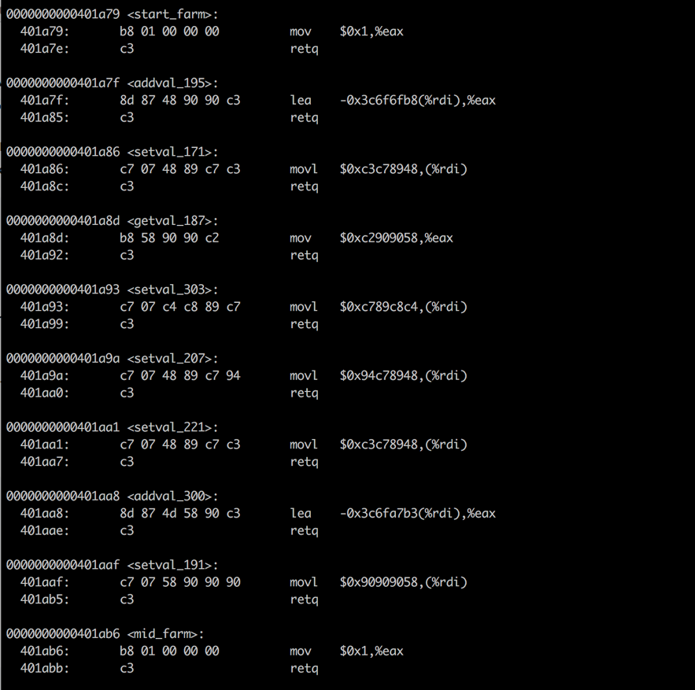

start_farm 부터 mid_farm 사이에 있는 gadget의 목록입니다.

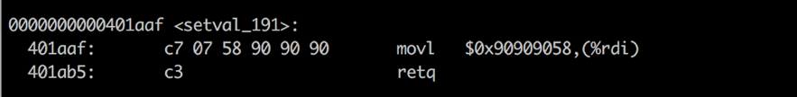

58이 포함되어 있으므로 그 위치인,
401aaf + 2 = 401ab1

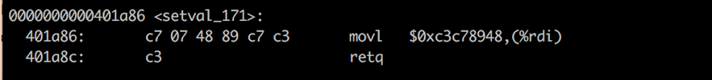

48 89 c7 포함되어 있으므로 그 위치는
401a86 + 2 = 401a88

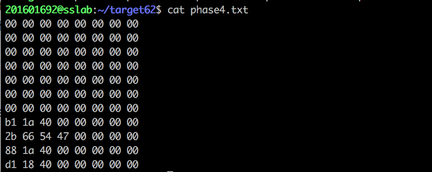

따라서
패딩 56개,
첫번째 gadget 위치,
쿠키,
두번째 gadget 위치,
touch2의 주소를 입력해주면 성공입니다 !

